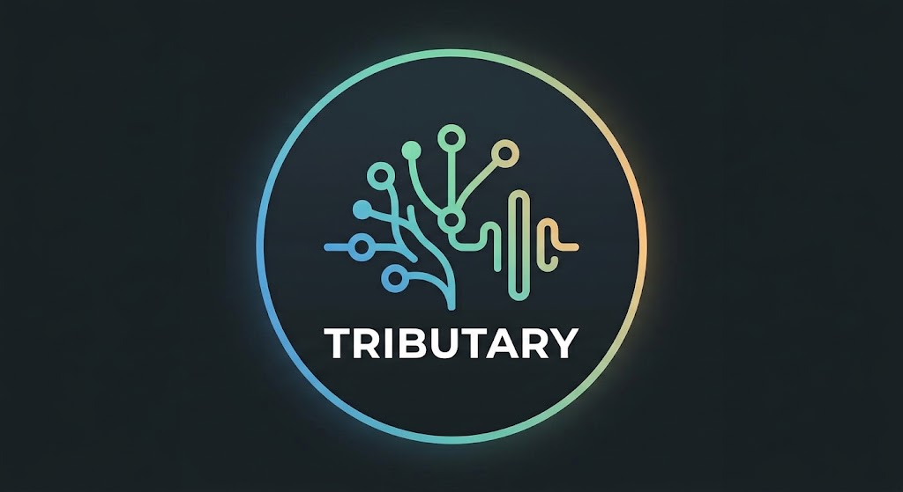

# Tributary

A ground-up open source DAW (Digital Audio Workstation) with these design goals:

- A headless engine exposed by an easy to adopt API / MCP.
- An immutable event-sourced project model with decentralised distributed storage support.
- First-class serverless collaboration support for both humans with multiple client UI's and agents.
- Can leverage modern GPU hardware for massive project scale.
- A promise that by using open file formats, immutable and open source FX plugins, lossless upcast support, your old projects remain playable, editable and bit accurate* 20 years later.

* NOTE: Bit accurate may only apply to a slow deterministic CPU render, GPU bit accuracy may not be able to be guaranteed due to the nature of GPU and kernel libraries.
